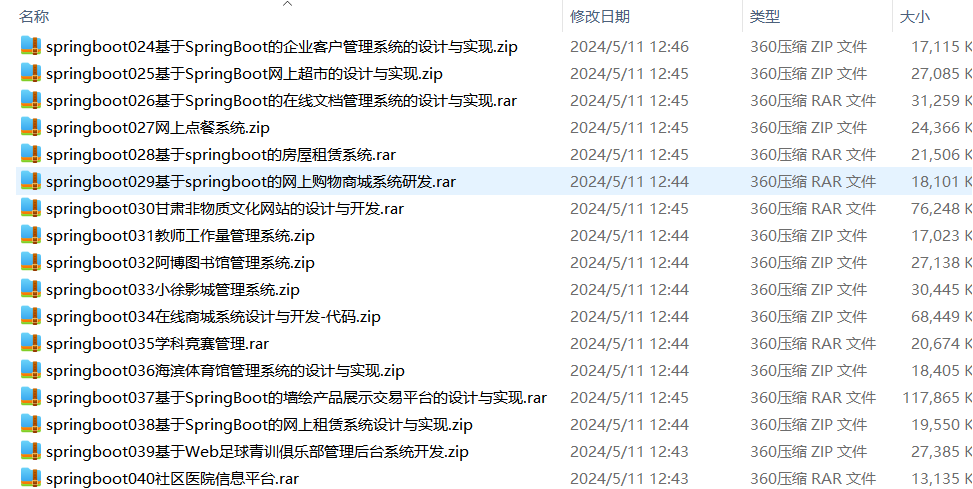

# springboot_job_dance_fanstore_campus_edu
### **项目介绍**

💼 **大学生就业招聘系统** —— 职位发布、简历投递、在线面试，助力高校毕业生高效求职 🎓📄

💃 **古典舞在线交流平台** —— 舞蹈教学、视频分享、社区互动，推动古典舞艺术的传承与交流 🎭🎶

🌟 **明星周边产品销售网站** —— 商品展示、粉丝互动、在线交易，满足粉丝群体的个性化消费需求 🛍️🎁

📚 **校园资料分享平台** —— 学习资源上传、文档管理、在线讨论，促进校园知识共享 📖🔍

🎓 **在线教育系统** —— 课程管理、直播教学、作业批改，打造高效便捷的在线学习环境 🏫🖥️

本仓库采用 **SpringBoot** 作为核心后端，结合 **Spring Security、Redis、MySQL、MyBatis Plus、Vue.js** 等技术，提供高效、稳定的企业级 Web 应用解决方案。欢迎 **Star ⭐、Fork 🍴**，一起学习进步！ 🚀💡

项目部署说明✨：

推荐使用：谷歌浏览器

后台地址😎
http://localhost:8080/springboot/admin/dist/index.html

管理员  abo 密码 abo

前台地址😎

http://localhost:8080/springboot/front/index.html

在src\main\resources\application.yml中编辑数据库配置🎉										
url: jdbc:mysql://127.0.0.1:3306/springboot?useUnicode=true&characterEncoding=utf-8&useJDBCCompliantTimezoneShift=true&useLegacyDatetimeCode=false&serverTimezone=UTC
username: root
password: 123456

文档预览👀

其他项目合集✨

